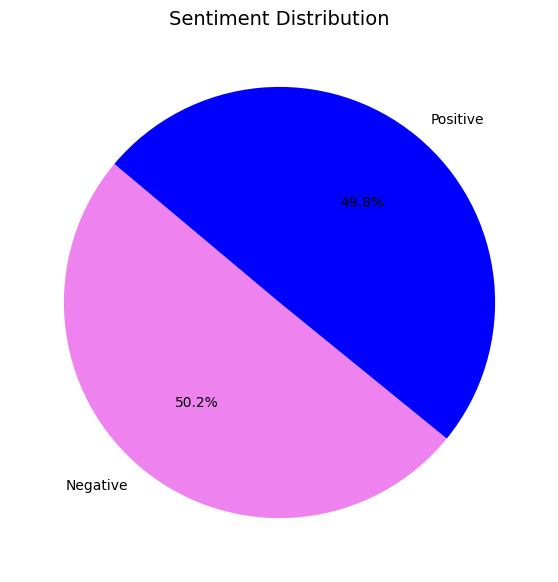
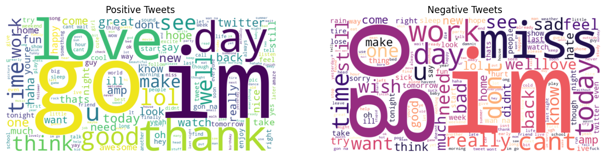
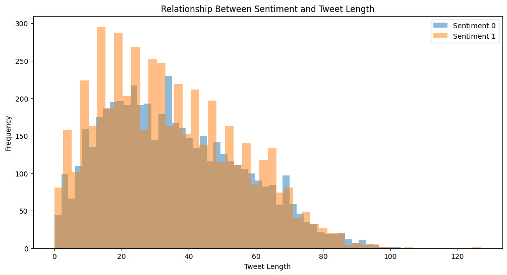
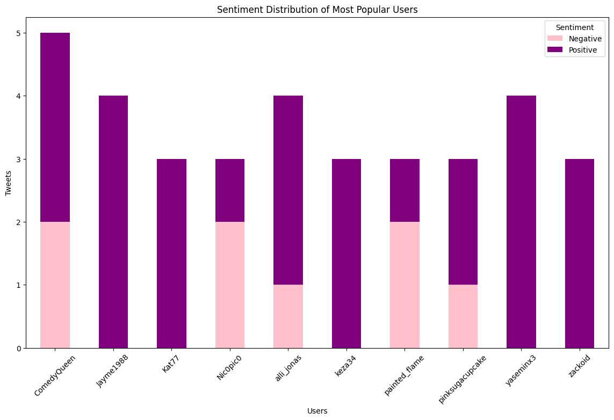
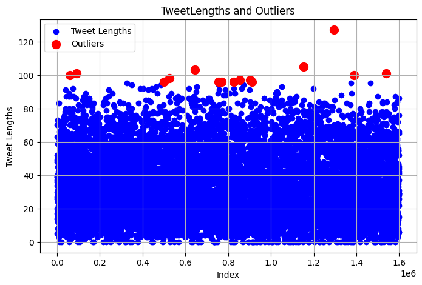

# Twitter Sentiment Analysis

 

## Dataset

This project utilizes a dataset designed for sentiment analysis on Twitter, where each tweet is labeled with sentiment values:
- **0** for negative sentiment
- **4** for positive sentiment

[The dataset Source](https://www.kaggle.com/datasets/kazanova/sentiment140)

### Data Size

The dataset is approximately **227.74 MB** in size.

## Overview

In this project, various libraries are imported for data manipulation and visualization. The dataset is read from a CSV file, ensuring that special characters are properly handled through the appropriate encoding.

### Data Sampling

Given the large size of the dataset, a random sample of **10,000** rows is extracted for analysis. This step allows for efficient processing while still providing a representative subset of the data.

*The data preparation process ensures that we have a manageable dataset to work with, facilitating further analysis and modeling in sentiment classification tasks.*

## EDA - Exploratory Data Analysis

Exploratory Data Analysis (EDA) is a crucial step in understanding the dataset. It involves analyzing fundamental characteristics such as missing values, data types, and the general structure of the data. This phase also includes visualizations to gain insights into the dataset.

### Key Steps

1. **Viewing Sample Data**: The first few rows of the sampled dataset are examined to get an initial sense of the data.
2. **Data Information**: Basic information about the dataset, including data types and non-null counts, is accessed to identify any potential issues.
3. **Missing Values**: The total number of missing (NaN) values for each column is calculated to understand the completeness of the dataset.
4. **Column Renaming**: The columns are renamed for better readability, making it easier to work with the data.
5. **Filtered DataFrame**: A new DataFrame is created, filtering only the relevant columns for further analysis.

This thorough examination helps to prepare the data for subsequent analysis and modeling.

## Data Preprocessing

Data preprocessing is a vital step in preparing the dataset for effective analysis and modeling. This process includes several key actions:

### Key Steps

1. **Text Normalization**: 
   - Convert all text to lower case to ensure uniformity.
   - Remove @ mentions and hyperlinks to eliminate unnecessary information.
   - Remove punctuations and numbers that do not contribute to sentiment analysis.

2. **Text Processing with NLTK**: 
   - **Stopwords**: Downloading the NLTK list of stopwords, which includes common words (e.g., 'the', 'is', 'and') that are typically irrelevant for analysis.
   - **Tokenization**: Using the 'punkt' model to split text into sentences and words for easier manipulation.
   - **Lemmatization**: Downloading the WordNet database to reduce words to their base forms, improving the analysis of text data.

3. **Text Manipulation**: 
   - Additional steps to clean the text include removing extra spaces, rare words, and duplicated rows.

4. **Target Variable Adjustment**: 
   - Preparing the target variable for model training.

5. **Converting Texts to Numerical Vectors**: 
   - The TF-IDF (Term Frequency-Inverse Document Frequency) transformation is applied to convert text data into a numerical format. This transformation enables models to effectively understand the text, leading to better predictions during the analysis.

This preprocessing stage is essential for ensuring that the data is in the best possible shape for subsequent modeling and analysis tasks.

## Data Visualization

### Sentiment Distribution Analysis

 

The pie chart illustrates the distribution of sentiments in the dataset:

- **Positive Sentiments**: 49.8%
- **Negative Sentiments**: 50.2%

### Most Frequent Positive and Negative Words Cloud

 

In the word clouds, words are visualized according to their frequencies:

- **Positive Tweets** include words such as: *im, good, love, thank, lol, go*.
- **Negative Tweets** include words such as: *im, miss, work, go, today, cant*.

### Relationship Between Sentiment and Tweet Length

 

The analysis of tweet length reveals interesting insights. As the length of tweets increases, the distribution of positive and negative sentiments also changes. Specifically, for tweet lengths between 0 - 80 characters, the frequency of positive tweets ranges from 0 - 200. Notably, shorter tweets (highlighted in brown) tend to express more positivity.

### Sentiment Distribution of Users

 

According to the analysis, the tweets of the top 10 users generally exhibit positive sentiment, indicating a tendency towards uplifting communication among these users.

### Outliers

 

Further investigation is needed to identify and understand any outliers present in the dataset, which may affect the overall sentiment analysis.

## Algorithm Selection & Hyperparameter Optimization

### Training and Test Data Separation

After applying the TfidfVectorizer, we obtain a set of numerical features for each tweet, which serve as the independent variables for model training. We denote the resulting matrix of TF-IDF feature vectors as **X**, representing the input data for our models.

### Supervised Learning

#### Model Selection

1. **Logistic Regression (LR)**
   - **Accuracy**: 71.86%
   - **Risk of Overfitting**: Lower
   - **Training Time**: Faster
   - **Interpretability**: Higher
   - **Precision and Recall**:
     - Class 0: 74% precision, 68% recall
     - Class 1: 70% precision, 75% recall

2. **Support Vector Classifier (SVC)**
   - **Accuracy**: 71.96%
   - **Risk of Overfitting**: May be higher
   - **Training Time**: Longer
   - **Interpretability**: Lower
   - **Precision and Recall**:
     - Class 0: 74% precision, 68% recall
     - Class 1: 70% precision, 76% recall

Given the results, the Logistic Regression model is preferred due to its interpretability, speed, and lower risk of overfitting. It strikes a balance between performance and practicality.

### Hyperparameter Optimization

For hyperparameter optimization, **Randomized Search** has been selected for its efficiency, broad coverage, global optimization capabilities, minimal assumptions, and speed. The results indicate that the model achieves an accuracy of **73.18%** with optimized hyperparameters. The use of the saga solver and the determined C value has potential to further enhance the model's performance.

### Training the Model

- **True Positives (TP)**: 753 (Correctly predicted positive instances)
- **True Negatives (TN)**: 680 (Correctly predicted negative instances)
- **False Positives (FP)**: 320 (Incorrectly predicted negative instances as positive)
- **False Negatives (FN)**: 234 (Incorrectly predicted positive instances as negative)

**Precision**:
- Class 0: 0.74
- Class 1: 0.70

High precision indicates the proportion of true positive predictions among all positive predictions.

**Recall**:
- Class 0: 0.68
- Class 1: 0.76

High recall shows how effectively the model identifies actual positive instances.

**F1-Score**:
- Class 0: 0.71
- Class 1: 0.73

The F1 score, being the harmonic mean of precision and recall, provides a better measure for imbalanced datasets.

**Overall Accuracy**: 72%

This accuracy represents the proportion of correctly predicted instances out of the total. The higher recall for class 1 suggests the model better identifies this class, while the lower recall for class 0 indicates some misclassification as positive.

### Unsupervised Learning

The K-Means clustering results show a **Silhouette score** of **0.0664**. Although this value is positive, it is relatively low, indicating that the clusters are somewhat close to each other. Further analysis is required to optimize the number of clusters based on the Silhouette score.
